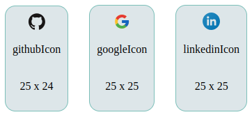

# Installation
### NPM
```bash
npm install @infostacks/ui-icons
```
# Social Media Icons
<picture>

</picture>

**# Integration in Your Project**
```
import {addIcon} from '@infostacks/ui-icons';
```

```
<i className="icons-package" dangerouslySetInnerHTML={{__html: addIcon()}}></i>
```
