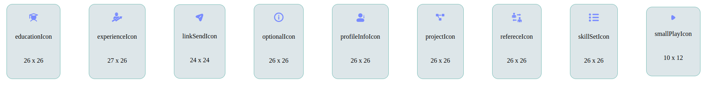

# Installation
### NPM
```bash
npm install @infostacks/ui-icons
```
# Social Media Icons
<picture>

</picture>

# Integration in Your Project
To integrate the social media icons into your project, follow these steps:
```
import {addIcon} from '@infostacks/ui-icons';
```

```
<i className="icons-package" dangerouslySetInnerHTML={{__html: addIcon()}}></i>
```
# Simple Icons

<picture>

</picture>

# Default Color Icons

<picture>

</picture>

# How to use
import { addIcon } from '@infostacks/ui-icons';

/**
 * Render Default Color Icon.
 *
 * @param {string} color - The fill color for the icon.
 */

```
const renderDefaultColorIcon = () => {
  return (
    <i className={"icons-package"} dangerouslySetInnerHTML={{__html: addIcon(color:"name")}}></i>
  );
};
```

# Active Color Icons

<picture>

</picture>

# How to use
import { addIcon } from '@infostacks/ui-icons';

/**
 * Render Active Color Icon.
 *
 * @param {boolean} isActive - Whether the icon is active or not.
 * @param {string} [fillLight='#788BFF'] - The fill color in light mode.
 * @param {string} [fillDark='#3326C9'] - The fill color in dark mode.
 */
```
const renderActiveColorIcon = (isActive, fillLight = '#788BFF', fillDark = '#3326C9') => {
  return (
    <i className={"icons-package "} dangerouslySetInnerHTML={{__html: addIcon(true,fillLight,fillDark)}}></i>
  );
};
```
